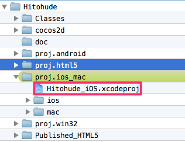

#Hitohude GCS 2014 デモバージョン

##概要

GCS2014の講演にて利用したcocos2d-html5, cocos2d-x jsbのデモゲームです。

###[デモを遊んでみる(クリックしてください)](http://oceans.s57.xrea.com/html5games/hitohude/)

スマートフォンでも一応遊べますが一部演出がカットされます。
（サウンドファイルはライセンスの都合上付属しておりません）。

##開発、動作確認環境

###開発に利用したOS、ソフトウェア

- Mac OS X 10.9.2 Maverick
- Chrome, Safari( Firefoxではsimulator.htmlで問題あり )
- Xcode 5.0.2

###動作確認プラットフォーム

- HTML5版
- iOS版

**(Android,Win版は未確認)**

##ビルド方法

### iOS版

Hitohude_iOS.xcodeprojを開き、Xcodeでビルド＆実行してください。

****

### HTML版

pythonを使い、PC上に簡易サーバーを立ち上げます。
README.mdのフォルダの場所を作業フォルダとして、次のコマンドをターミナルで実行します。

	python -m SimpleHTTPServer

8000ポートでサーバーが起動するので、ブウラザのアドレスバーに次のURLを入力してください。

	http://localhost:8000/proj.html5/simulator.html

>画面が真っ黒な場合は、新規タブを作成してもう一度入力するとうまくいくことがあります。

##ゲームの遊び方

タイトル画面をタップすると、ゲームが始まります。

ゲーム画面は、３つのパネルで構成されます。

- 白色
- 黒色
- 黄色

**白と黒のパネルはタップ、もしくはなぞると色が反転**します。**黄色はフリー移動パネル**です。
画面上の黒いパネルをひとふで書きでなぞり、全てのパネルを白にしてください。

ゲームにリトライなどは実装していませんので、失敗、もしくは成功した場合は、
ブラウザをリロードしてください。

